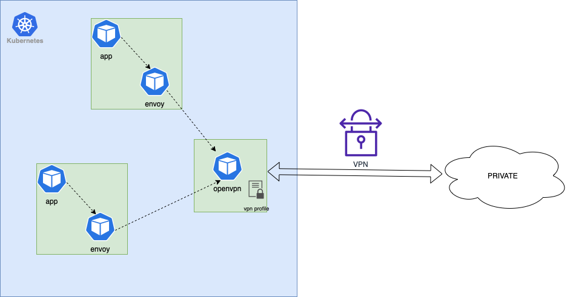

# codenow-openvpn

- Codenow-openvpn repo obsahuje openvpn komponentu + setup pro vytvoreni VPN spojeni mezi CodeNow Kubernetes a klientskou privatni siti.  

- Openvpn komponenta bezi jako samostany deployment/POD a obsahuje konfiguraci, certifikaty a profil potrebny pro navazani VPN spojeni. Veskere prichozi tcp packety jsou z openvpm PODu preposilany smerem do privatni site a zpet.  

- Helm package mimo jine obsahuje istio/envoy konfiguraci ktera pro vsechny PODy v meshi resi staticky DNS resolving pro privatni domeny a routovani veskereho workload trafficu do openvpn PODu ktery jej preposla do VPN site.  

### nasazeni

toto repo slouzi pouze jako sablona nebo jako inspirace pro konfiguraci vpn site v k8s . Nasazeni na klientsky Kubernetes by melo byt nasledujici:

- zkopirovani tohoto repository do zakaznickerho codenow gitlabu  
- nastavit privatni IP adresu v run.sh a soucasne do values.yaml
- nastavit privatni domeny ve values.yaml (envoy bude statcku prekladat tyto domeny na privatni IP) 
- nastavit interni k8s adresu sluzby openvpn (envoy bude routovat privatni domeny na tuto adresu)
- do adresare codenow/config/ nakopirovat prislusne certifikaty, klice a confiruaci vpn profilu potrebne pro navazani vpn spojeni
- registrovat repo do CodeNow jako Docker komponentu  (bud do stavajici aplikace nebo vytvorit novou)  
- CodeNow build + deploy  

### overeni
- overit ze openvpn container jede a neloguje errory  
- z openvpn containeru zkusit pres curl zavola endpoint ve vpn domene
- z libovolneho aplikacniho containeru zkusit pres curl zavola endpoint ve vpn domene  
